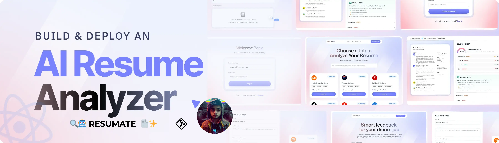

<div align="center">
  <br />
      
    </a>
  <br />

  <div>
    
    
    
    
  </div>

  <h3 align="center">🤖📄 RESUMATE – YOUR SMART AI RESUME ANALYZER</h3>

  <div align="center">
    Analyze and optimize your resume with the power of AI. Built using modern tools, serverless tech, and clean UI.
  </div>
</div>

---

## 📋 Table of Contents

1. ✨ [Introduction](#introduction)
2. ⚙️ [Tech Stack](#tech-stack)
3. 🔋 [Features](#features)
4. 🤸 [Quick Start](#quick-start)
5. 🔗 [Assets](#assets)
6. 🚀 [More](#more)

---

## ✨ Introduction

**RESUMATE** is a full-stack AI Resume Analyzer built with React, Tailwind CSS, TypeScript, and Puter.js. It allows users to upload their resumes, receive instant feedback, ATS scores, and improve their chances of landing their dream job — all with the help of AI.

This is a great hands-on project to understand:
- AI integration
- Client-side serverless development
- Modular React UI architecture

---

## ⚙️ Tech Stack

- **React** – For building reusable UI components.
- **Tailwind CSS** – Utility-first CSS framework for responsive styling.
- **TypeScript** – Strong typing and tooling support.
- **Puter.js** – Serverless SDK for auth, storage, and AI features.
- **React Router v7** – For client-side routing.
- **Vite** – Modern dev server with lightning-fast HMR.
- **Zustand** – Lightweight state management for React.

---

## 🔋 Features

- ✅ **Authentication**: Simple browser-only auth via Puter.js.
- 📄 **Resume Upload**: Secure upload and storage of resumes.
- 🎯 **AI-Powered Analysis**: ATS score + personalized suggestions.
- 💬 **Feedback Tailored to Job Listings**.
- 🎨 **Beautiful UI/UX**: Clean, responsive interface.
- 🔧 **Reusable Components**: Modular codebase for scalability.
- 🌐 **Fully Responsive**: Works great on mobile, tablet, and desktop.
- 🧠 **AI Integration**: Use GPT, Claude, or other AI services.

---

## 🤸 Quick Start

### Prerequisites

- [Git](https://git-scm.com/)
- [Node.js](https://nodejs.org/)
- [npm](https://www.npmjs.com/)

### 1. Clone the Repository

```bash
git clone https://github.com/Abhranil2004/ai-resume-analyzer-RESUMATE.git
cd resumate
````

### 2. Install Dependencies

```bash
npm install
```

### 3. Run the Development Server

```bash
npm run dev
```


---

## 🔐 Authentication & Data Management

* **Logout**:
  To log out of your account, visit:
  [`http://localhost:5173/auth`](http://localhost:5173/auth)

* **Clear App Data** (wipe all local data/cache):
  [`http://localhost:5173/wipe`](http://localhost:5173/wipe)

> ⚠️ Note: This will reset your session and remove any locally stored data.
---
## 🚀 More

This is just the beginning for **RESUMATE**. Future updates may include:

* 🌍 Language support
* 📤 Export optimized resume
* 🧾 Job suggestion engine
* 🔐 Role-based access
* 📊 Resume insights dashboard

---

**🎨 Designed & Developed by [Abhranil Dutta](https://github.com/Abhranil2004)**
🛠️ Maintained by the community & powered by open-source.

---

> 📫 For feedback or collaboration: [Email Me](mailto:abhranildutta1903@gmail.com)


